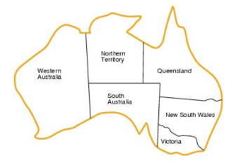

Constraint Optimization with Google OR Tools

### Purpose

- Become familiar with Google OR Tools to solve optimization problems
- Apply Google OR Tools CP-SAT solver library to
  - Represent a constraint satisfaction problem (CSP)
  - Solve a CSP

### Virtual Environment

For this lab, you'll work locally on your machine:
- Use `conda` to create and activate a virtual environment named `cpenv`
- Install the `ortools` package
- Upon successful installation of necessary packages, generate `cpenv.yml`:
  - `conda env export > cpenv.yml`
  - Use version control to add `cpenv.yml` to the local repo.

### Develop CP-SAT Solutions

#### Preliminary Reading

From the [Google OR-Tools Constraint Optimization](https://developers.google.com/optimization/cp) section, read the following sections;
- Overview
- CP-SAT Solver
- Solving a CP Problem.

#### Solve the N-Queens Problem

**Implementation**
- Read carefully the [N-queens Problem](https://developers.google.com/optimization/cp/queens)
- Create `n_queens.py` module
- Write the code from the [N-queens Problem](https://developers.google.com/optimization/cp/queens) source, step by step, to understand the implementation. 
- Document the code appropriately
- Check and fix the formatting problems reported by VS Code
- Use version control to evidence the development process. 

#### Solve the Map Coloring Problem

- Create `map_coloring.py` module
- Apply what you have learned from solving the N-queens problem to solve the Australia's mainland coloring problem (described in Week 5 slides, and shown below)
- Document the code appropriately
- Check and fix the formatting problems reported by VS Code
- Use version control to evidence the development process.

##### Map Coloring Example
What is the CSP graph of Australia's Mainland states and territories? 
- Note: It does not include the state of Tasmania island

##### Map Coloring CSP Graph Example

- Variables: states, represented by nodes
- Values: 3 colors (reg, green, blue)
- Constraints: binary (between two variables), not equal
